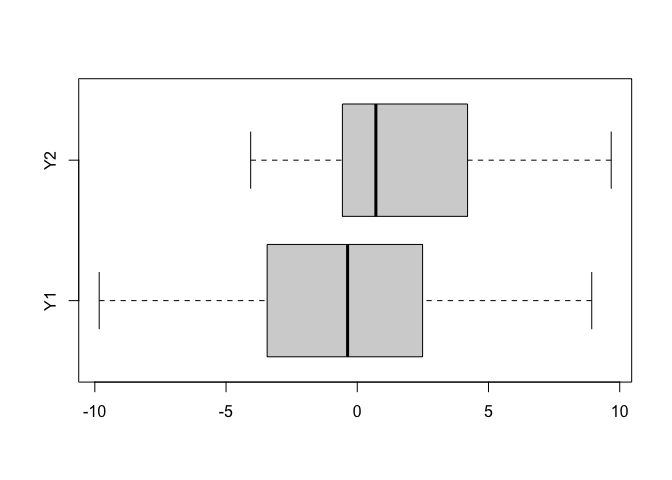

Ch04
================
VincentAlegrete
2024-12-24

### Problem Statement

We will do something equivalent to the t-test using Stan. Using the data
generated from the following R code, we want to decide whether the mean
parameter $\mu_1$ in group one (<tt>Y1</tt>) differs from $\mu_2$ in
group two (<tt>Y2</tt>) by computing $\text{Prob}[\mu_1 < \mu_2]$, which
is the probability of $\mu_1 < \mu_2$.

``` r
set.seed(123)
N1 <- 30
N2 <- 20
Y1 <- rnorm(n=N1, mean=0, sd=5)
Y2 <- rnorm(n=N2, mean=1, sd=4)
```

#### Part (1)

Visualize the data from these two groups so that we can intuitively see
whether the difference exists between them.

<i>Solution</i>

Boxplots for $Y_1$ and $Y_2$ suggest that the distribution centers and
spreads are different.

``` r
boxplot(Y1, Y2, names=c("Y1", "Y2"), horizontal=TRUE)
```

<!-- -->

#### Part (2)

Write a model formula with the assumption that these two groups have the
same SD. This corresponds to the Students’ t-test.

<i>Solution</i>

With the assumption that $\text{Var}(Y_1)=\text{Var}(Y_2)$, then our
likelihoods (under flat priors for $\mu_1,\mu_2,\sigma$) are

$$
\begin{align}
Y_1|\mu_1,\sigma&\sim N(\mu_1,\sigma^2)\\
Y_2|\mu_2,\sigma&\sim N(\mu_2,\sigma^2)
\end{align}
$$

We will build posterior distributions for both means in the next two
subproblems.

#### Part (3)

Create the model file of (2) in Stan and estimate the parameters. Don’t
use <tt>generated quantities</tt> block here yet, because in the next
(4) we will be practicing how to make use of draws from R or Python.

<i>Solution</i>

The below is saved to a file named <tt>model3.stan</tt>.

``` stan
data {
  int N1;
  int N2;
  vector[N1] Y1;
  vector[N2] Y2;
}

parameters {
  real mu1;
  real mu2;
  real<lower=0> sigma;
}

model {
  Y1 ~ normal(mu1, sigma);
  Y2 ~ normal(mu2, sigma);
}
```

#### Part (4)

Compute $\text{Prob}[\mu_1 < \mu_2]$ from the obtained draws using R or
Python (hint: we can count how many times the event $\mu_1 < \mu_2$
occurs in the entire draws, and divide this quantity by the total number
of draws).

<i>Solution</i>

We run the model in STAN, generate our posterior draws, and display the
model summary. I had to play around with <tt>seed</tt> until finding one
that didn’t initialize $\sigma$ at 0. Also, I suppressed the chain
iteration updates with <tt>refresh = 0</tt> once I found a good seed.

``` r
library(cmdstanr)
data <- list(N1=N1, N2=N2, Y1=Y1, Y2=Y2)
# model3 <- cmdstan_model(stan_file='model3.stan')
fit <- model3$sample(
  data = data, 
  seed = 42,
  refresh = 0
)
```

    ## Running MCMC with 4 sequential chains...
    ## 
    ## Chain 1 finished in 0.0 seconds.
    ## Chain 2 finished in 0.0 seconds.
    ## Chain 3 finished in 0.0 seconds.
    ## Chain 4 finished in 0.0 seconds.
    ## 
    ## All 4 chains finished successfully.
    ## Mean chain execution time: 0.0 seconds.
    ## Total execution time: 0.7 seconds.

``` r
fit$cmdstan_summary()
```

    ## Inference for Stan model: model_2a691b2dca5b164356fe35b71cf22e71_model
    ## 4 chains: each with iter=1000; warmup=1000; thin=1; 1000 iterations saved.
    ## 
    ## Warmup took (0.015, 0.014, 0.013, 0.014) seconds, 0.056 seconds total
    ## Sampling took (0.023, 0.022, 0.023, 0.023) seconds, 0.091 seconds total
    ## 
    ##                  Mean     MCSE  StdDev    MAD        5%    50%   95%  ESS_bulk  ESS_tail  R_hat
    ## 
    ## lp__              -98  3.1e-02     1.3    1.0  -1.0e+02    -97   -96      1963      2294   1.00
    ## accept_stat__    0.92  5.5e-03    0.10  0.065      0.71   0.96   1.0      5193      4043    1.0
    ## stepsize__       0.78      nan   0.052  0.038      0.69   0.80  0.83       nan       nan    nan
    ## treedepth__       2.3      nan    0.57   0.00       1.0    2.0   3.0       203       147    1.0
    ## n_leapfrog__      4.9  3.0e-01     2.1    3.0       3.0    3.0   7.0       146        96    1.0
    ## divergent__      0.00      nan    0.00   0.00      0.00   0.00  0.00       nan       nan    nan
    ## energy__           99  4.6e-02     1.8    1.6        97     99   103      1629      2133    1.0
    ## 
    ## mu1             -0.24  1.3e-02    0.82   0.81  -1.6e+00  -0.26   1.1      4212      2615    1.0
    ## mu2               1.6  1.6e-02     1.0    1.0  -1.9e-02    1.6   3.3      3947      2469   1.00
    ## sigma             4.5  8.4e-03    0.48   0.46   3.8e+00    4.4   5.4      3450      2416    1.0
    ## 
    ## Samples were drawn using hmc with nuts.
    ## For each parameter, ESS_bulk and ESS_tail measure the effective sample size for the entire sample (bulk) and for the .05 and .95 tails (tail), 
    ## and R_hat measures the potential scale reduction on split chains. At convergence R_hat will be very close to 1.00.

MCMC convergence looks good: <tt>R_hat</tt> is $<1.1$ and
<tt>ESS_bulk</tt> $>100$ for all parameters. Therefore, we keep the
posterior draws, store them into a data frame, and compute
$\text{Prob}[\mu_1 < \mu_2]$ empirically:

``` r
draws <- fit$draws(format='df')
prob <- sum((draws$mu1 - draws$mu2) < 0) / dim(draws)[1]
prob
```

    ## [1] 0.9275

So the posterior probability that $\mu_1 < \mu_2$ is approximately
$92.75\%$.

#### Part (5)

Write a model formula with the assumption that the two SDs are
different. This is equivalent to the Welch’s t-test. Similarly, compute
$\text{Prob}[\mu_1 < \mu_2]$.

<i>Solution</i>

In this scenario, our likelihoods are

$$
\begin{align}
Y_1|\mu_1,\sigma_1&\sim N(\mu_1,\sigma_1^2)\\
Y_2|\mu_2,\sigma_2&\sim N(\mu_2,\sigma_2^2)
\end{align}
$$

We make the necessary adjustments to our model file and resave as
<tt>model5.stan</tt>:

``` stan
data {
  int N1;
  int N2;
  vector[N1] Y1;
  vector[N2] Y2;
}

parameters {
  real mu1;
  real mu2;
  real<lower=0> sigma1;
  real<lower=0> sigma2;
}

model {
  Y1 ~ normal(mu1, sigma1);
  Y2 ~ normal(mu2, sigma2);
}
```

Then recompile, refit, and check convergence:

``` r
fit2 <- model5$sample(
  data = data, 
  seed = 42,
  refresh = 0
)
```

    ## Running MCMC with 4 sequential chains...
    ## 
    ## Chain 1 finished in 0.0 seconds.
    ## Chain 2 finished in 0.0 seconds.
    ## Chain 3 finished in 0.0 seconds.
    ## Chain 4 finished in 0.0 seconds.
    ## 
    ## All 4 chains finished successfully.
    ## Mean chain execution time: 0.0 seconds.
    ## Total execution time: 0.5 seconds.

``` r
fit2$cmdstan_summary()
```

    ## Inference for Stan model: model_64562a136809b7da86779e976ea0763d_model
    ## 4 chains: each with iter=1000; warmup=1000; thin=1; 1000 iterations saved.
    ## 
    ## Warmup took (0.015, 0.014, 0.015, 0.015) seconds, 0.059 seconds total
    ## Sampling took (0.025, 0.023, 0.024, 0.025) seconds, 0.097 seconds total
    ## 
    ##                  Mean     MCSE  StdDev    MAD    5%    50%   95%  ESS_bulk  ESS_tail  R_hat
    ## 
    ## lp__              -95    0.036     1.5    1.3   -98    -95   -94      1760      2313    1.0
    ## accept_stat__    0.92  5.7e-03   0.097  0.068  0.72   0.95   1.0      5177      4014    1.0
    ## stepsize__       0.68      nan   0.045  0.025  0.60   0.69  0.72       nan       nan    nan
    ## treedepth__       2.6  2.9e-02    0.53   0.00   2.0    3.0   3.0      2639       749    1.0
    ## n_leapfrog__      5.7      nan     1.9   0.00   3.0    7.0   7.0       218       158    1.0
    ## divergent__      0.00      nan    0.00   0.00  0.00   0.00  0.00       nan       nan    nan
    ## energy__           97  5.4e-02     2.1    1.9    95     97   101      1504      2125    1.0
    ## 
    ## mu1             -0.26    0.015    0.95   0.90  -1.8  -0.24   1.2      4141      2642    1.0
    ## mu2               1.6    0.015    0.84   0.80  0.22    1.6   3.0      3420      1800    1.0
    ## sigma1            5.1    0.013    0.72   0.69   4.1    5.0   6.5      3657      2878    1.0
    ## sigma2            3.6    0.011    0.64   0.59   2.8    3.6   4.8      3482      2602    1.0
    ## 
    ## Samples were drawn using hmc with nuts.
    ## For each parameter, ESS_bulk and ESS_tail measure the effective sample size for the entire sample (bulk) and for the .05 and .95 tails (tail), 
    ## and R_hat measures the potential scale reduction on split chains. At convergence R_hat will be very close to 1.00.

MCMC diagnostics look good, so we retain the samples and use them to
empirically compute the posterior probability:

``` r
draws2 <- fit2$draws(format='df')
prob2 <- sum((draws2$mu1 - draws2$mu2) < 0) / dim(draws2)[1]
prob2
```

    ## [1] 0.93375

Therefore, $\text{Prob}(\mu_1<\mu_2|Y_1,Y_2)\approx 93.38\%$. This is an
improvement on our initial t-test, suggesting that model specification
plays an important role in getting the best results possible.
